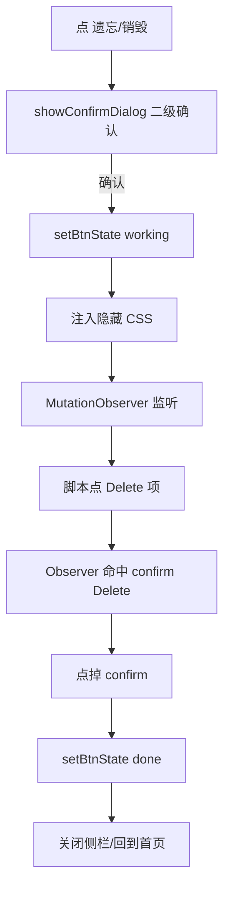
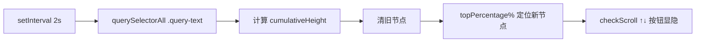

# 系统架构与业务上下文

## 🎯 业务最终目标

让 Gemini 浏览器交互具备**"平行推演" + "看完即焚"** 能力 —— 主对话保持主线，支线在侧边栏平行推演不污染上下文；看完的分支可一键物理销毁（云端 + 客户端双清）。每个会话窗口拥有独立的时间轴视图，节点归属清晰。

**核心价值**：避免主线污染 + 切窗断流两个深度使用 Gemini 的坏形态。

## 🧩 核心模块划分

| 模块名 | 职责描述 | 对外暴露接口 | 依赖的其他模块 |
|--------|---------|-------------|---------------|
| `renderTimeline`（主屏） | 在 `document.body` 创建 `#gemini-timeline-container`，fixed 在主屏右侧；渲染主屏对话节点 | `setInterval(renderTimeline, 2000)` 周期渲染 | 无 |
| `renderSidebarTimelineInIframe` | 在 `iframe.contentDocument` 创建 `#gemini-sidebar-timeline-container`，渲染侧栏对话节点；**不**带 FAB | `setInterval(... , 2000)` 周期渲染（用 `iframe._sidebarTimelineInterval` 防累积） | `injectCSSIntoIframe` |
| `performDestroyOnDocument` | 通用销毁引擎：菜单打开 → Delete → confirm 弹窗 物理点击；支持主屏和 iframe 两种 doc | 返回 `{ success, reason }` | `executeForgetBranch` / `destroyMainConversation` |
| `executeForgetBranch` | 侧栏分支销毁入口（走 iframe doc） | UI 触发（侧栏标题栏 🗑️ 遗忘） | `performDestroyOnDocument` |
| `destroyMainConversation` | 主屏销毁入口（走 document） | UI 触发（时间轴嵌的 🗑️ 销毁） | `performDestroyOnDocument` + `renderTimeline` |
| `openSidebar` | 打开侧边栏 iframe + 注入侧栏时间轴 | UI 触发（划词菜单 💡 或时间轴 💡 FAB） | `injectCSSIntoIframe` + `renderSidebarTimelineInIframe` |

## 🗄️ 核心数据模型

无持久化数据模型 —— 纯 DOM 操作 + `setInterval` 轮询节点位置。

## 🔌 API 契约概览

无对外 API。Chrome 扩展 content script 模式，仅与 Gemini DOM 交互（`document` / `iframe.contentDocument`）。

## 🔀 核心数据流 / 状态管理

### 销毁流程（executeForgetBranch）

### 时间轴渲染（主屏 + 侧栏）

## ⚡ 非功能性需求 (NFR)
| 指标 | 目标值 | 备注 |
|------|--------|------|
| 销毁闪烁 | 0 帧 | 用户视觉上看不到 Gemini confirm 弹窗（CSS 隐藏 + Observer 边听边点） |
| 时间轴节点精度 | 98% 容器高度内 | `Math.min(topPercentage, 98)` 防溢出 |
| 多次开关侧栏 | 不累积 interval | `iframe._sidebarTimelineInterval` 防泄漏 |
| 选择器兼容性 | `data-testid` + `data-test-id` 双写 | 兼容 Gemini 改版前/后 |

## 🚀 部署拓扑
- **环境**: 仅 Chrome 扩展（无 staging/prod 区分）
- **容器化**: 无（纯前端扩展）
- **CI/CD**: 无（手动加载到 `chrome://extensions/`）
- **CDN/静态资源**: 无（无网络资源）

## 📐 架构决策记录 (ADR) 索引
| # | 日期 | 决策 | 原因 | 状态 |
|---|------|------|------|------|
| 1 | 2026-06-04 | executeForgetBranch 闪烁消失 = CSS 隐藏 + Observer 边听边点 | CSS 同步应用，弹窗节点插入 DOM 同一帧就 `display: none` | ✅ 生效 |
| 2 | 2026-06-05 | destroy-fab 和 💡 fab **视觉对齐**时间轴（同一 `right: 30px`），但 **position: fixed 独立浮窗**（不嵌在容器内） | 30px 容器 + 100px 胶囊 + 嵌容器内 = 横跨容器+外侧 70px，必然 100% 覆盖节点和 ↑↓ 按钮（横向 + 纵向 overlap）；固定 `right` 偏移保持视觉对齐，fixed 定位彻底解耦 | ✅ 生效 |
| 3 | 2026-06-04 | 每个会话/窗口独立时间轴（主屏 doc 一个 + 侧栏 iframe doc 一个） | 时间轴是会话的视觉表达，应跟随会话所在窗口 | ✅ 生效 |
| 4 | 2026-06-04 | 侧栏时间轴**不**带 FAB（节点 + ↑↓ 即可） | 避免视觉杂乱；侧栏标题栏的 🗑️ 遗忘继续负责销毁分支 | ✅ 生效 |

> 详细决策内容请参考 [MEMORY.md](/MEMORY.md) 中的 ADR 章节。
